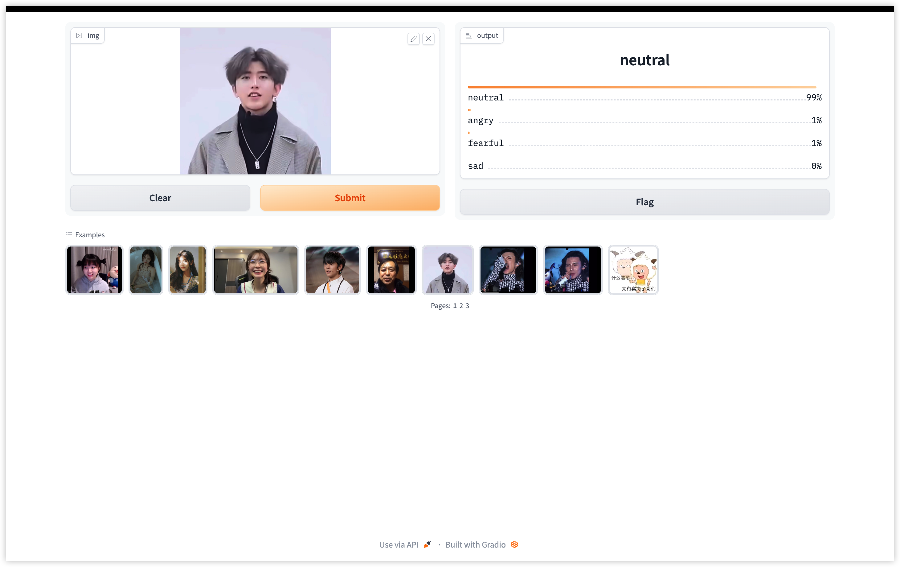

# Emotion

This software recognizes human faces and their corresponding emotions from a video or webcam feed. Powered by OpenCV and Deep Learning.

#### real time video detect


#### using via website or api



## Installation

### Direct

Clone the repository:
```bash
git clone https://github.com/ch1y1z1/EmoDetect
cd EmoDetect/
```

Install these dependencies with 
```pip install -r requirements.txt```


Once the dependencies are installed, you can run the project.
```python main.py```

### run with docker

```bash
docker build -t emo_detect .
docker run -d -p 8000:7860 emo_detect
```

visit `http://[your host]:8000` to have a try


## To train your own model for emotion classification

To train.
```python train.py```


## Deep Learning Model


## Credit

* Computer vision powered by OpenCV.
* Neural network scaffolding powered by Pytorch.
* Convolutional Neural Network (CNN) deep learning architecture 

## Thanks

* our teachers Kong and Liu
* eastern 26 building
* kunkun
* Zhen Ding
